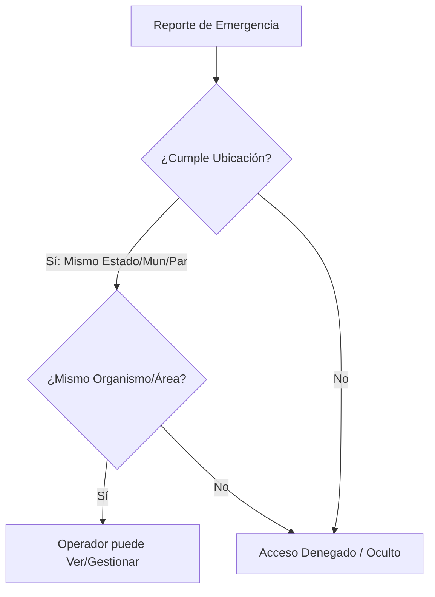

# Documento de Requerimientos Funcionales - Panel de Administración y Operadores

Este documento establece la base de los requerimientos funcionales para el sistema de gestión de emergencias y reportes de Venezuela, enfocado en el panel administrativo y los perfiles de operadores.

---

## 1. Perfiles y Roles de Usuario

El sistema contará con al menos dos roles principales con niveles de acceso diferenciados:

### A. Administrador (`jochdev` / Admin)
Tiene control total sobre la plataforma. Sus funciones principales incluyen:
- **Gestión de Organismos de Seguridad:** Creación, edición, deshabilitación y asignación de organismos válidos en la plataforma (ej. Bomberos, Protección Civil, Policías).
- **Gestión de Operadores:** Crear, editar, activar/desactivar y asignar perfiles geográficos y de organismos a los operadores.
- **Configuración Global:** Acceso a parámetros del sistema, reportería global y logs de auditoría.

### B. Operadores
Usuarios encargados del monitoreo y atención de incidentes. Su visibilidad de datos está restringida por su ubicación geográfica y su organismo de adscripción.
El perfil de un operador debe contener obligatoriamente:
- **Datos Personales y de Identificación:**
  - Nombre(s)
  - Apellido(s)
  - DNI (Cédula de Identidad)
- **Asociación Institucional:**
  - Organismo de Seguridad (ej. Bomberos del Municipio Libertador)
- **Alcance Geográfico (Filtro de Datos):**
  - Estado
  - Municipio
  - Parroquia

---

## 2. Lógica de Filtrado Geográfico y Seguridad

El propósito del alcance geográfico configurado en el perfil del operador es delimitar la información que este puede ver e interactuar en la aplicación.



### Reglas de Visibilidad Geográfica:
1. **Nivel Estado:** Si el operador tiene configurado un *Estado* (y municipio/parroquia en "Todos"), podrá ver todos los incidentes y reportes asociados a ese Estado.
2. **Nivel Municipio:** Si el operador tiene configurado *Estado* y *Municipio*, su visibilidad se limitará únicamente a los reportes dentro de ese municipio.
3. **Nivel Parroquia:** Si se especifican los tres niveles (*Estado*, *Municipio* y *Parroquia*), el operador solo interactuará con datos de esa parroquia específica.

---

## 3. Requerimientos Funcionales Detallados (RF)

### Módulo de Seguridad y Acceso
*   **RF-01 (Autenticación sin Contraseña):** El sistema debe permitir el inicio de sesión seguro para Administradores y Operadores con correo electrónico mediante código de un solo uso (OTP) / Magic Link enviado y validado por Supabase.
*   **RF-02 (Control de Acceso basado en Roles - RBAC):** Restringir las rutas y recursos de la API según el rol (Admin vs. Operador).

### Módulo de Administración (Solo Admin)
*   **RF-03 (Gestión de Organismos de Seguridad):**
    *   Crear, leer, actualizar y deshabilitar (CRUD) Organismos de Seguridad.
    *   Definir el tipo de organismo (Nacional, Estadal, Municipal).
*   **RF-04 (Gestión de Operadores):**
    *   Registrar nuevos operadores asignándoles un Organismo de Seguridad y su delimitación geográfica.
    *   Visualizar el estado de conexión o actividad reciente de los operadores.

### Módulo de Operadores
*   **RF-05 (Bandeja de Incidentes Filtrada):**
    *   Visualizar incidentes y reportes en tiempo real que correspondan al Estado, Municipio y Parroquia configurados en su perfil.
*   **RF-06 (Gestión del Perfil de Operador):**
    *   El operador puede visualizar sus datos (nombre, apellido, DNI, organismo y ubicación asignada), pero **no** puede editarlos (esto queda restringido únicamente al administrador).
    *   El operador puede cambiar su foto de perfil (el inicio de sesión y validación de perfil es manejado por OTP mediante Supabase).

---

## 4. Estructura de Datos y Diseño en Base de Datos (Supabase / PostgreSQL)

Para asegurar la máxima eficiencia y compatibilidad con las **Políticas de Seguridad por Fila (RLS)** de Supabase, la cobertura geográfica se maneja a nivel de columnas relacionales optimizadas, permitiendo valores nulos (*Nullish values*) para representar coberturas jerárquicas amplias.

### Esquema de Tablas (DDL)

```sql
-- 1. Extensión para UUIDs (si no está activa)
create extension if not exists "uuid-ossp";

-- 2. Crear Tabla de Organismos de Seguridad
create table organismos (
  id uuid default gen_random_uuid() primary key,
  nombre text not null,
  siglas text not null,
  tipo text not null check (tipo in ('Nacional', 'Estadal', 'Municipal')),
  activo boolean default true not null,
  created_at timestamp with time zone default timezone('utc'::text, now()) not null
);

-- 3. Crear Tabla de Perfiles (Enlazada a auth.users de Supabase)
create table perfiles (
  id uuid references auth.users on delete cascade primary key,
  email text unique not null,
  rol text not null check (rol in ('admin', 'operador')),
  nombre text not null,
  apellido text not null,
  dni text unique not null,
  organismo_id uuid references organismos(id),
  
  -- Cobertura Geográfica Estricta
  cobertura_estado_id int not null,
  cobertura_municipio_id int, -- Si es null, el operador aplica a todo el estado
  cobertura_parroquia_id int, -- Si es null, el operador aplica a todo el municipio
  
  activo boolean default true not null,
  created_at timestamp with time zone default timezone('utc'::text, now()) not null
);

-- 4. Crear Tabla de Refugios
create table refugios (
  id uuid default gen_random_uuid() primary key,
  created_at timestamp with time zone default timezone('utc'::text, now()) not null,
  
  -- Ubicación Geográfica
  estado_id int not null,
  municipio_id int not null,
  parroquia_id int not null,
  direccion_exacta text not null, -- Ej: "Gimnasio Cubierto, Av. Libertador"
  
  -- Información del Refugio
  nombre_refugio text not null, -- Ej: "Refugio Provisional Escuela Trina Briceño"
  responsable_contacto text,    -- Nombre de la autoridad o líder comunitario a cargo
  telefono_contacto text,
  
  -- Capacidad y Logística
  capacidad_maxima int,
  poblacion_actual int default 0,
  insumos_urgentes text,       -- Ej: "Se necesitan colchonetas, sábanas y agua"
  
  activo boolean default true not null
);
```

---

## 5. Implementación de Seguridad por Fila (RLS) en Supabase

Para cumplir de forma transparente y segura con el filtrado geográfico en el backend, la tabla de `reportes_victimas` implementará la siguiente política. Esto garantiza que un operador no pueda consultar información fuera de su jurisdicción, incluso intentando manipular las peticiones HTTP desde la consola del navegador.

```sql
alter table reportes_victimas enable row level security;

create policy "Los operadores solo ven reportes de su cobertura geográfica"
  on reportes_victimas
  for select
  using (
    auth.uid() in (
      select id from perfiles 
      where rol = 'admin' 
         or (
           activo = true 
           and reportes_victimas.estado_id = cobertura_estado_id
           and (cobertura_municipio_id is null or reportes_victimas.municipio_id = cobertura_municipio_id)
           and (cobertura_parroquia_id is null or reportes_victimas.parroquia_id = cobertura_parroquia_id)
         )
    )
  );
```

### Derivación de Casos (Transferencia de Incidentes)
El sistema permitirá derivar casos cuando un incidente escale o requiera apoyo. Para esto:
*   La tabla `reportes_victimas` contará con campos como `asignado_a_organismo_id` o `cobertura_temporal`.
*   Por defecto, el incidente adopta la ubicación geográfica del suceso.
*   Si un operador deriva el caso, simplemente se actualiza el ID del organismo o el territorio correspondiente, disparando la actualización en la bandeja del nuevo operador en tiempo real usando Supabase Realtime.

---

## 6. Módulo de Auditoría y Bitácora (`logs_auditoria`)

Este módulo protege la integridad de los datos, previene fugas de información sensible y permite auditar en tiempo real qué operador atendió, modificó o derivó cada caso.

### Estructura de Datos para la Bitácora

```sql
create table logs_auditoria (
  id uuid default gen_random_uuid() primary key,
  created_at timestamp with time zone default timezone('utc'::text, now()) not null,
  
  -- Quién realizó la acción
  perfil_id uuid references perfiles(id) on delete set null,
  operador_nombre text not null, -- Respaldo en texto si se elimina el perfil
  organismo_siglas text,         -- Contexto del organismo al momento del evento
  
  -- Qué acción se realizó
  accion text not null, -- Ej: 'INICIO_SESION', 'VER_REPORTE', 'MODIFICAR_ESTATUS', 'DERIVAR_CASO'
  tabla_afectada text,  -- Ej: 'reportes_victimas', 'auth'
  registro_id uuid,     -- ID del reporte o recurso afectado
  
  -- Detalles adicionales (JSON flexible)
  detalles jsonb,       -- Ej: {"antes": "Desaparecido", "despues": "A salvo"}
  
  -- Ubicación desde donde audita
  cobertura_contexto text
);

-- Índices de alto rendimiento para filtros administrativos
create index idx_logs_created_at on logs_auditoria(created_at desc);
create index idx_logs_accion on logs_auditoria(accion);
```

### Automatización con Triggers en PostgreSQL

Para garantizar el registro inmutable de cambios en los reportes, se utiliza un disparador en la base de datos que se ejecuta tras cada actualización:

```sql
create or replace function registrar_cambio_reporte()
returns trigger as $$
begin
  insert into logs_auditoria (perfil_id, operador_nombre, accion, tabla_afectada, registro_id, detalles)
  values (
    auth.uid(),
    (select nombre || ' ' || apellido from perfiles where id = auth.uid()),
    'MODIFICAR_ESTATUS',
    'reportes_victimas',
    new.id,
    jsonb_build_object('estatus_anterior', old.estado_persona, 'estatus_nuevo', new.estado_persona)
  );
  return new;
end;
$$ language pljs/plpgsql;

create trigger trigger_auditoria_reportes
after update on reportes_victimas
for each row
execute function registrar_cambio_reporte();
```

---

## 7. Ajustes en el Frontend (Nuxt & Tailwind CSS)

1.  **Estado Global del Operador:** Al iniciar sesión, la cobertura del operador se cargará y persistirá en el estado global de Nuxt (`useState` o Pinia) para pre-filtrar las consultas y optimizar el rendimiento.
2.  **Campos de Solo Lectura (RF-06):** Los campos DNI y adscripción a Organismo usarán las clases de Tailwind `bg-gray-100 text-gray-500 cursor-not-allowed` junto con el atributo `readonly`.
3.  **Vista de Auditoría para el Administrador (`jochdev`):**
    *   Filtros por Operador y por Acción.
    *   Presentación en tabla compacta con fuentes monoespaciadas (`text-xs font-mono`) para optimizar la densidad de información y lectura rápida.
4.  **Priorización Automática de Incidentes (Triage Algorítmico):**
    Cuando se maneje un alto volumen de reportes en tiempo real, el sistema priorizará visualmente los incidentes según su severidad (combinando el estado de la persona y detalles del entorno):
    *   **Prioridad 1 (Atrapado / Herido + Estructura colapsada):** Fila con parpadeo suave rojo (`bg-red-950/40 text-red-400 border-l-4 border-red-500`).
    *   **Prioridad 2 (Desaparecido):** Fila naranja (`bg-amber-950/20 text-amber-400 border-l-4 border-amber-500`).
    *   **Prioridad 3 (A salvo / Requiere traslado o insumos):** Fila azul o gris según el estándar de la interfaz de usuario.


